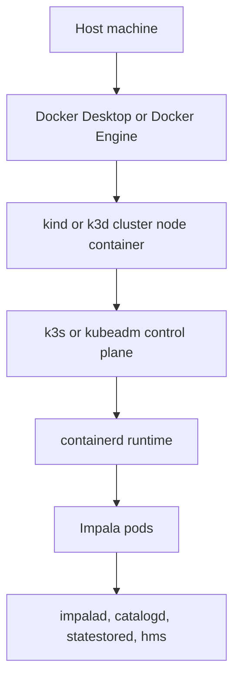
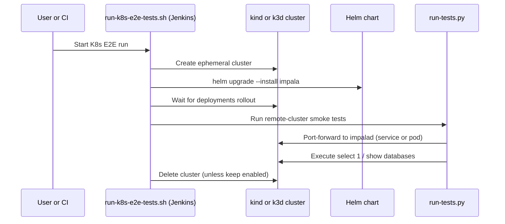

<!--
 Licensed to the Apache Software Foundation (ASF) under one
 or more contributor license agreements.  See the NOTICE file
 distributed with this work for additional information
 regarding copyright ownership.  The ASF licenses this file
 to you under the Apache License, Version 2.0 (the
 "License"); you may not use this file except in compliance
 with the License.  You may obtain a copy of the License at

   http://www.apache.org/licenses/LICENSE-2.0

 Unless required by applicable law or agreed to in writing,
 software distributed under the License is distributed on an
 "AS IS" BASIS, WITHOUT WARRANTIES OR CONDITIONS OF ANY
 KIND, either express or implied.  See the License for the
 specific language governing permissions and limitations
 under the License.
-->

# Kubernetes-in-Docker E2E Testing

This document explains how Impala Kubernetes smoke tests run inside Docker-based
local clusters and CI runners.

## Why this exists

Impala already has end-to-end tests that can connect to remote clusters. For
Kubernetes development and CI, it is useful to create an ephemeral Kubernetes
cluster inside Docker, deploy the Impala Helm chart, run smoke tests, and then
tear everything down.

The repository includes:

- `bin/jenkins/run-k8s-e2e-tests.sh` for cluster lifecycle and chart deployment
- `bin/run-k8s-e2e-tests.sh` for remote-cluster test execution
- `tests/infra/test_k8s_external_cluster.py` for smoke coverage

## Runtime architecture

At a high level, this is "container-in-container":



Notes:

- The outer runtime is Docker.
- Kubernetes workloads inside the node container are managed by containerd.
- Images used for Impala components are still pulled from OCI registries.

## Test flow



## Selecting the runtime

`bin/jenkins/run-k8s-e2e-tests.sh` supports:

- `K8S_E2E_RUNTIME=kind` (default)
- `K8S_E2E_RUNTIME=k3d`

Example:

```bash
K8S_E2E_RUNTIME=k3d ./bin/jenkins/run-k8s-e2e-tests.sh
```

## Port-forward mode

`bin/run-k8s-e2e-tests.sh` supports:

- `K8S_PORT_FORWARD_MODE=auto` (default): service first, then pod fallback
- `K8S_PORT_FORWARD_MODE=service`: service only
- `K8S_PORT_FORWARD_MODE=pod`: pod only

This helps when service-level forwarding is flaky in some local Docker-based
Kubernetes environments.

## Smoke test scope

Current smoke coverage validates:

- HS2 connectivity (`select 1`)
- Catalog visibility (`show databases`)

This is intentionally minimal for fast verification in ephemeral clusters.
