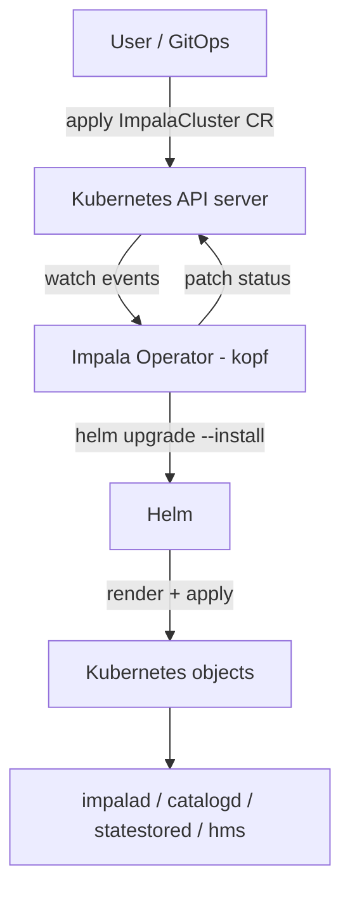
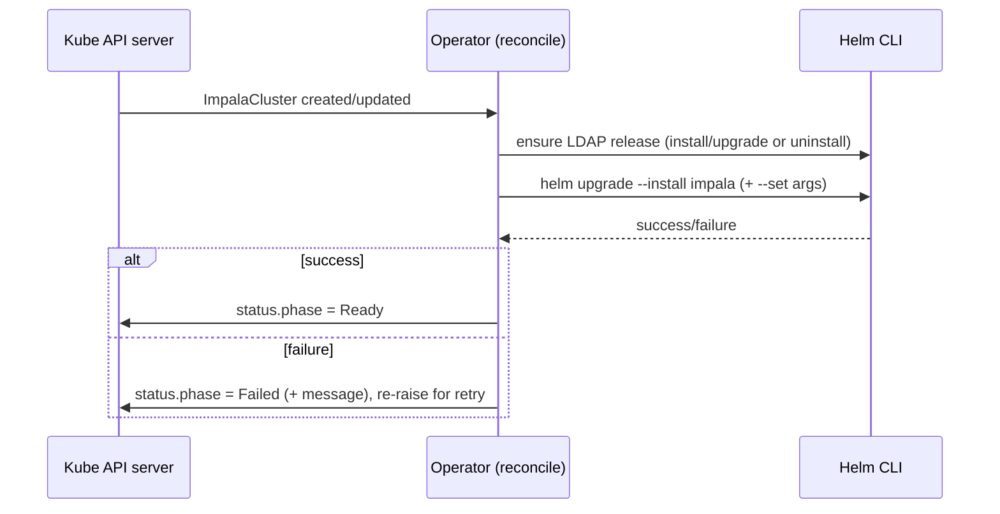
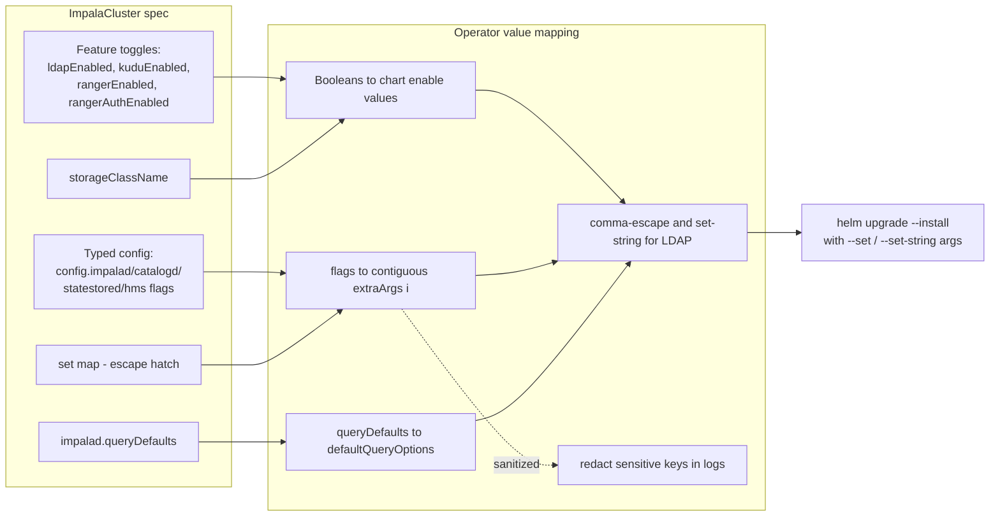

<!--
 Licensed to the Apache Software Foundation (ASF) under one
 or more contributor license agreements.  See the NOTICE file
 distributed with this work for additional information
 regarding copyright ownership.  The ASF licenses this file
 to you under the Apache License, Version 2.0 (the
 "License"); you may not use this file except in compliance
 with the License.  You may obtain a copy of the License at

   http://www.apache.org/licenses/LICENSE-2.0

 Unless required by applicable law or agreed to in writing,
 software distributed under the License is distributed on an
 "AS IS" BASIS, WITHOUT WARRANTIES OR CONDITIONS OF ANY
 KIND, either express or implied.  See the License for the
 specific language governing permissions and limitations
 under the License.
-->

# Impala Kubernetes Operator Design

This document describes the design of the Impala Kubernetes Operator: what it
is responsible for, how it reconciles Impala deployments, and the boundaries it
intentionally keeps. It is meant to give contributors a single reference for the
operator's architecture and the trade-offs behind it.

## Goals

- Provide a declarative, Kubernetes-native way to run Impala using a single
  `ImpalaCluster` custom resource.
- Reuse the existing Impala Helm chart as the unit of deployment instead of
  re-implementing manifest templating in the operator.
- Manage the full lifecycle (create, update, delete) of the core Impala release
  and its optional dependencies.
- Keep the control-plane footprint small and auditable, using least-privilege
  RBAC.
- Remain event-driven and idempotent so repeated reconciles converge to the
  same state.

## Non-goals

- The operator does not replace the Helm chart or duplicate its templating; the
  chart remains the source of truth for rendered Kubernetes objects.
- It does not manage cluster-wide prerequisites such as namespaces, storage
  classes, or ingress controllers.
- It does not perform Impala-level administration (query tuning, catalog
  operations, data placement) beyond passing through configuration to the chart.
- It is not a multi-tenant scheduler; one `ImpalaCluster` maps to one set of
  Helm releases in its own namespace.

## Background

Impala on Kubernetes is delivered in layers. The Helm chart (`helm/impala`)
renders the core daemons (`impalad`, `catalogd`, `statestored`) plus the Hive
Metastore and optional components (Kudu, Ranger, LDAP). The chart is fully
usable on its own.

The operator sits one level above the chart. It lets users describe the desired
Impala deployment as a custom resource and delegates the actual rendering and
apply to Helm. This keeps a clean separation: the chart owns "what a deployment
looks like", and the operator owns "how a deployment is driven over time".

## High-level architecture

The operator is a Python process built on the
[Kopf](https://kopf.readthedocs.io/) framework. It watches `ImpalaCluster`
resources and shells out to the `helm` CLI (bundled in the operator image) to
install or upgrade releases.

Key properties:

- The operator holds no long-lived state of its own. Desired state lives in the
  `ImpalaCluster` spec; observed state lives in Helm release history and the CR
  status.
- Helm is invoked with `upgrade --install`, so a reconcile is safe to run
  repeatedly.
- The bundled chart is copied into the operator image, so the operator does not
  depend on an external chart repository for the core Impala release.

## Custom resource: ImpalaCluster

- Group / version: `impala.apache.org/v1alpha1`
- Kind: `ImpalaCluster` (short name `icluster`)
- Scope: `Namespaced`
- Subresources: `status`

The CRD (`manifests/crd-impalacluster.yaml`) defines a typed spec so users get
schema validation from the API server. The important spec areas are:

- Release selection: `impalaReleaseName`, `ldapReleaseName`, chart/values path
  overrides, and `helmTimeoutSeconds`.
- Feature toggles: `kuduEnabled`, `rangerEnabled`, `rangerAuthEnabled`,
  `ldapEnabled`, and LDAP connection fields (`ldapUri`, `ldapBindPattern`).
- Storage: `storageClassName`, applied to both the Impala and Kudu persistence
  values.
- Typed daemon configuration: `config.impalad`, `config.catalogd`,
  `config.statestored`, and `config.hms`, each accepting `flags` (startup flags)
  and, for `impalad`, `queryDefaults` (default query options).
- Escape hatch: a free-form `set` map for advanced Helm `--set` overrides.

The `status` subresource records `phase`, `message`, `observedGeneration`,
`lastReconcileTime`, and `targetNamespace`.

## Reconciliation model

The operator registers three handlers, plus a startup hook:

- `on.startup`: loads kube config (in-cluster first, then local kubeconfig) and
  registers the finalizer `impala.apache.org/finalizer`.
- `on.create` and `on.update`: run the same `reconcile` path.
- `on.delete`: uninstalls the managed releases.

Reconcile steps:

1. Resolve the target namespace (see "Namespace model").
2. Ensure the LDAP dependency matches `ldapEnabled`: install/upgrade the
   OpenLDAP release when enabled, or uninstall it when disabled. This makes the
   toggle converge in both directions.
3. Render the Helm `--set` / `--set-string` arguments from the spec and run
   `helm upgrade --install` for the core Impala release with `--wait`.
4. On success, patch the status to `Ready`. On failure, patch the status to
   `Failed` with the error message and re-raise so Kopf retries with backoff.

Idempotency comes from `helm upgrade --install` plus a `helm status` existence
check that chooses between `install` and `upgrade`.

## Configuration mapping

The operator translates the typed spec into Helm values. The main concerns are
correctness of value encoding and safety of logged commands.

- Feature toggles map to boolean chart values
  (`kudu.enabled`, `ranger.enabled`, `auth.ranger.enabled`, `auth.ldap.enabled`).
- Daemon `flags` become contiguous `extraArgs[i]` entries per component. Indices
  are kept contiguous on purpose: sparse indices make Helm render empty list
  items that can turn into blank container arguments.
- `impalad.queryDefaults` is joined into a single `defaultQueryOptions` value.
- Values are comma-escaped before being passed to `--set`, because Helm parses
  `--set` values as CSV-like entries. LDAP URI and bind pattern use
  `--set-string` to avoid type coercion of characters like `#`.
- Sensitive values are redacted in logs. Any `--set` / `--set-string` key that
  looks like a secret (password, token, keytab, credential, etc.) is printed as
  `<redacted>`, while the real value is still passed to Helm.

The following diagram shows how the typed spec is transformed into the Helm
arguments used for the release:

Note that only the log output is sanitized; the operator still passes the real
values to Helm so the release is configured correctly.

## Namespace model

`ImpalaCluster` is namespaced, so `metadata.namespace` must already exist before
the CR is created. The operator always reconciles into `metadata.namespace`. A
legacy `spec.namespace` field, if set and different, is ignored with a warning
rather than honored. This keeps a single, unambiguous source of truth for
placement and avoids the operator needing permission to create namespaces.

## RBAC and security model

The operator ships two ClusterRoles bound to a dedicated service account in
`impala-operator-system`:

- `impala-operator-control-plane`: watch/patch `impalaclusters` and their
  `status`/`finalizers`, emit events, and read (`get`/`list`/`watch`) CRDs for
  Kopf's watch machinery.
- `impala-operator-helm`: create/update/delete the namespaced object kinds that
  the Impala chart renders (Deployments, StatefulSets, Services, ConfigMaps,
  Secrets, PVCs, RBAC Roles/RoleBindings, and related supporting resources).

Security-relevant decisions:

- No `cluster-admin`. Permissions are enumerated so they can be audited and
  tightened per environment.
- No namespace create/get permission; the CR must target an existing namespace.
- Command logging redacts sensitive Helm values so operator logs are safe to
  ship to centralized logging.

## Packaging and deployment

- The operator image (`Dockerfile`) is based on a slim Python image, installs
  the `helm` CLI, installs pinned Python dependencies from `requirements.txt`,
  and copies both `main.py` and the Impala chart into the image.
- Install artifacts are grouped under `manifests/` and applied with Kustomize
  (`kustomization.yaml` references the CRD, RBAC, and Deployment).
- The Deployment ships a placeholder image reference that operators override
  with a concrete published tag or digest for real installs.
- Chart/values/timeout defaults are provided via environment variables so the
  same image can be repointed without a rebuild.

## Status, observability, and failure handling

- The `status` subresource is the primary signal: `phase` (`Ready`/`Failed`),
  a human-readable `message`, `observedGeneration`, `lastReconcileTime`, and the
  resolved `targetNamespace`.
- Helm runs use `--wait` with a configurable timeout so a reconcile only reports
  `Ready` after rollout completes.
- Failures set `phase = Failed` and re-raise, letting Kopf retry with backoff
  rather than silently dropping the error.
- Release uninstall treats "release: not found" as success so delete and
  disable paths are idempotent.

## Testing strategy

The operator is covered at multiple layers:

- Unit tests (`tests/test_main.py`) exercise the value-mapping, redaction, and
  command-construction logic without a live cluster.
- RBAC manifest tests (`tests/test_rbac_manifest.py`) assert the manifest stays
  least-privilege (for example, that no ClusterRole grants `namespaces`).
- Helm chart render assertions (`helm/impala/tests`) guard the rendered output
  that the operator ultimately applies.
- Kubernetes-in-Docker end-to-end smoke tests (delivered separately in the
  Impala on Kubernetes epic) deploy the chart into an ephemeral cluster and
  validate basic connectivity.

## Limitations and future work

- The API is `v1alpha1` and may change as the model matures.
- Optional dependencies such as OpenLDAP are pulled from an external chart repo
  at reconcile time; air-gapped installs need a mirror.
- The operator drives Helm through the CLI rather than a Go/SDK controller. This
  keeps the implementation small and readable, at the cost of shelling out.
- Richer status conditions, metrics, and finer-grained drift detection are
  natural follow-ups.
